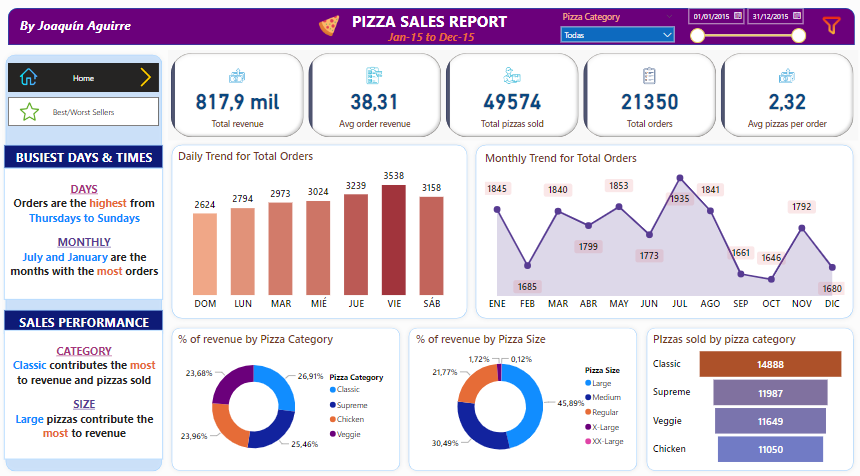
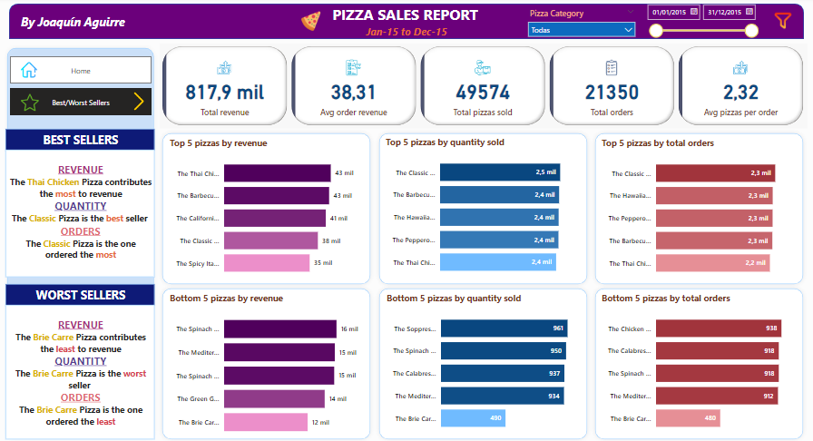
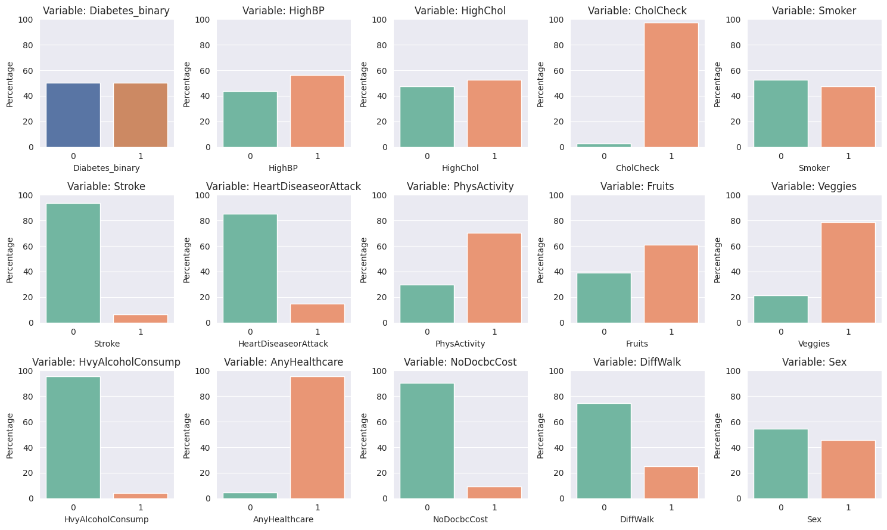
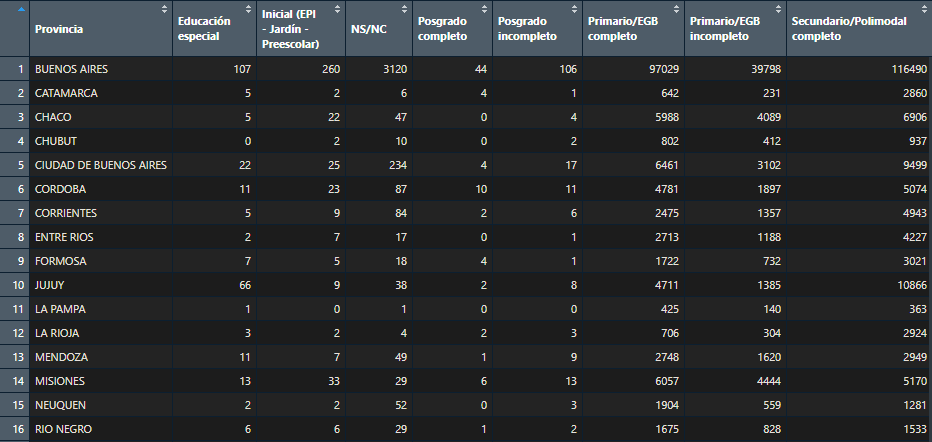
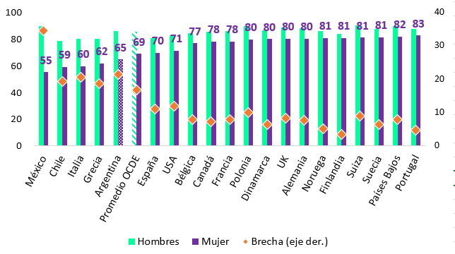

# Joaquín Aguirre

**Licenciado en Economía** por la Universidad Nacional de Córdoba (UNC), Diplomado en Ciencia de Datos por la FAMAF de la UNC y estudiante de la Maestría en Econometría de la Universidad Torcuato Di Tella (UTDT), con experiencia en consultoría e investigación académica.

**Intereses:** estadística, análisis y ciencia de datos, econometría, economía.

*Contacto:*
- ✉️ **e-mail**: jaguirre@mi.unc.edu.ar
- ☎️ **Teléfono**: +5493513993271
- 🔗 **LinkedIn**: [jaguirre-econ](https://www.linkedin.com/in/jaguirre-econ/)

### 📄 [Link a CV](https://github.com/jaguirre-econ/profile/blob/main/CV%20-%20Aguirre%2C%20Joaqu%C3%ADn.pdf)

# Proyectos de análisis y ciencia de datos

A continuación se puede acceder a diversos trabajos y documentos de mi autoría en los que fueron empleadas diferentes herramientas (*Power BI, SQL, Python, R, Paquete Office y LaTeX*).

## 📊 Power BI 

**Proyecto 'Pizza Sales':** 🔗 [**Link**](https://github.com/jaguirre-econ/Proyectos-Ciencia-de-Datos/blob/main/Pizza%20Sales%20Report.pbix)

Dashboard referido a una compañía ficticia dedicada a la venta de pizzas. 

## 💻 SQL

**Proyecto 'Pizza Sales':** 🔗 [**Link**](https://popsql.com/queries/-No2jud0rfRSZx59qnY9/pizza-sales?access_token=acc344688452e7b505fcfa84a59185ef)

Queries sobre el dataset referido a una compañía ficticia dedicada a la venta de pizzas. 

## 🐍 Python 

**Proyecto de Deep Learning 'Diabetes':** 🔗 [**Link**](https://github.com/jaguirre-econ/Proyectos-Ciencia-de-Datos/blob/main/Deep_Learning_Diabetes.ipynb)

Hecho en el marco de la Diplomatura en Ciencia de Datos de la FAMAF (UNC), se trabaja con un dataset con 70.692 entradas y 21 variables correspondiente a los resultados de una encuesta telefónica hecha en Estados Unidos en la que se le pregunta a cientos de miles de personas sobre sus condiciones de salud, siendo la mitad de los encuestados no diabéticos (Diabetes_binary = 0), y la otra mitad diabéticos (Diabetes_binary = 1). Luego de explorar el dataset (EDA) se entrenan modelos de redes neuronales que puedan predecir correctamente si un individuo es o no diabético de acuerdo a sus otras característcas. 

**Proyecto de Aprendizaje No Supervisado 'Películas IMDB':** 🔗 [**Link**](https://github.com/jaguirre-econ/Proyectos-Ciencia-de-Datos/blob/main/Non_Supervised_Movies.ipynb)

Hecho en el marco de la Diplomatura en Ciencia de Datos de la FAMAF (UNC), se trabaja con un data frame con datos correspondientes a más de 45 mil películas. Para cada una de ellas se pueden analizar 13 atributos diferentes, como el año de estreno, el género y su puntaje en la página de críticas y reseñas 'IMDB'. En este trabajo se explora y cura el dataset para luego poder aplicar técnicas de aprendizaje no supervisado que permiten generar clusters de películas.

## 📈 R

**Potenciar Trabajo con tidyverse:** 🔗 [**Link**](https://github.com/jaguirre-econ/Proyectos-Ciencia-de-Datos/blob/main/pot_trabajo.R)

A partir de una base de datos provista por el Ministerio de Trabajo con un listado de titulares del programa social 'Potenciar Trabajo' se utiliza el paquete tidyverse para obtener tablas que permitan analizar mejor cómo está compuesto este conjunto de individuos. Por ejemplo, cómo se distribuyen por provincia y nivel educativo.

**Estadísticas del Mercado Laboral con EPH:** 🔗 [**Link**](https://github.com/jaguirre-econ/Proyectos-Ciencia-de-Datos/blob/main/merc_lab.R)

La Encuesta Permanente de Hogares (EPH) es una encuesta nacional de casi 100.000 individuos de perioricidad trimestral. Con este script se obtienen diferentes estadísticas sobre la situación del mercado laboral, como las tasas de desempleo y de ocupación. Se pueden utilizar diferentes criterios para filtrar los resultados, como la provincia de residencia, el nivel educativo, el género o la edad.

## 🟩 Excel

**Estadísticas comparativas entre países de la OCDE:** 🔗 [**Link**](https://github.com/jaguirre-econ/Proyectos-Ciencia-de-Datos/blob/main/Gr%C3%A1ficos%20OCDE.xlsx)

Tablas y gráficos sobre la base de estadísticas comparativas entre países miembros de la OCDE y Argentina, con foco en las disparidades de género.

## 🗒️ Informes y presentaciones

- **Informe sobre la situación del mercado laboral y su relación con el nivel educativo:** 🔗 [**Link**](https://github.com/jaguirre-econ/Proyectos-Ciencia-de-Datos/blob/main/2023-07%20DR%20-%20Mercado%20Laboral%20y%20Educaci%C3%B3n%20Superior.pdf)
- **Presentación en PowerPoint sobre Sector de la Salud:** 🔗 [**Link**](https://github.com/jaguirre-econ/Proyectos-Ciencia-de-Datos/blob/main/IERAL%20-%20Salud%202021%20al%20I%2023.pdf)
- **Presentación de Tesis de Grado con Beamer:** 🔗 [**Link**](https://github.com/jaguirre-econ/Proyectos-Ciencia-de-Datos/blob/main/Presentaci%C3%B3n_Trabajo_Final.pdf)
- **Documento en RMarkdown con sintaxis de LaTeX:** 🔗 [**Link**](https://github.com/jaguirre-econ/Proyectos-Ciencia-de-Datos/blob/main/Gu%C3%ADa%20de%20Ejercicios%20de%20Econometr%C3%ADa%20II%20en%20RMarkdown.pdf)

