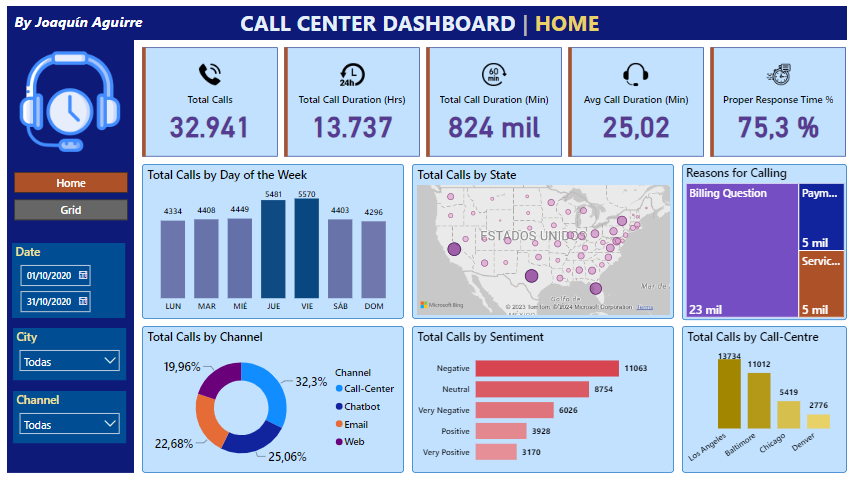
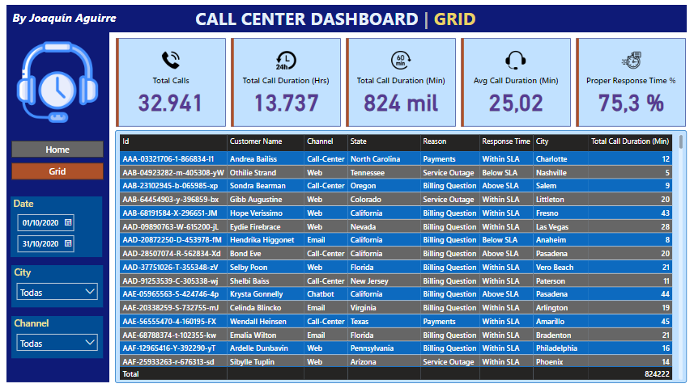

# Joaquín Aguirre

Argentinian student pursuing a Master's Degree in **Econometrics** at the Torcuato Di Tella University (UTDT), holding a Bachelor's Degree in **Economics** from the National University of Córdoba ([UNC](https://github.com/jaguirre-econ/perfil/blob/main/T%C3%ADtulo1.jpg)), and a Diploma in **Data Science** from the [FAMAF](https://github.com/jaguirre-econ/perfil/blob/main/Certificado%20Diplodatos.pdf) of the UNC, with experience in consulting, Marketing Mix Modeling and academic research.

**Interests**: statistics, data science, data analytics, econometrics, economics, research.

*Contact information:*
- ✉️ **e-mail**: jaguirre@mi.unc.edu.ar
- ☎️ **Phone**: +5493513993271
- 🔗 **LinkedIn**: [jaguirre-econ](https://www.linkedin.com/in/jaguirre-econ/?locale=en_US)

### 📄 [Link to CV](https://github.com/jaguirre-econ/profile/blob/main/CV%20-%20Aguirre%2C%20Joaqu%C3%ADn%20(english).pdf)

# Data science and analysis projects

Below you can access various works and documents of my authorship in which different tools were used (*Power BI, SQL, Python, R, Microsoft Office and LaTeX* ).

## 📊 Power BI 

**'Pizza Sales' Project:** 🔗 [**Link**](https://github.com/jaguirre-econ/Proyectos-Ciencia-de-Datos/blob/main/Pizza%20Sales%20Report.pbix)

Dashboard referring to a fictitious company dedicated to the sale of pizzas.

**'Call Center' Project:** 🔗 [**Link**](https://github.com/jaguirre-econ/Proyectos-Ciencia-de-Datos/blob/main/Call%20Center%20Report.pbix)

Dashboard referring to a call center company.

## 💻 SQL

**'Pizza Sales' Project:** 🔗 [**Link**](https://popsql.com/queries/-No2jud0rfRSZx59qnY9/pizza-sales?access_token=acc344688452e7b505fcfa84a59185ef)

Queries about the dataset referring to a fictitious company dedicated to the sale of pizzas.

**'Call Center' Project:** 🔗 [**Link**](https://popsql.com/queries/-NobXtad2CbNQI9Jftxr/call-centers?access_token=8c44159acf10f3fcb899148b90a341ce)

Queries about the dataset referring to a call center company.

## 🐍 Python 

**'Diabetes' Deep Learning Project:** 🔗 [**Link**](https://github.com/jaguirre-econ/Proyectos-Ciencia-de-Datos/blob/main/Deep_Learning_Diabetes.ipynb)

I work with a dataset with 70,692 entries and 21 variables corresponding to the results of a telephone survey carried out in the United States in which hundreds of thousands of people answered about their health conditions, with half of the respondents being non-diabetic (Diabetes_binary = 0), and the other half diabetic (Diabetes_binary = 1). After exploring the dataset (EDA), neural network models that can correctly predict whether an individual is diabetic or not according to their other characteristics are trained.

**'IMDB Movies' Unsupervised Learning Project:** 🔗 [**Link**](https://github.com/jaguirre-econ/Proyectos-Ciencia-de-Datos/blob/main/Non_Supervised_Movies.ipynb)

I work with a dataset with data corresponding to more than 45 thousand movies. For each of them, 13 different attributes can be analyzed, such as the year of release, the genre and its score on the 'IMDB' reviews page. In this project, the dataset is explored and curated to then be able to apply unsupervised learning techniques that allow the creation of movie clusters.

## 📈 R

**'Potenciar Trabajo' social program with tidyverse:** 🔗 [**Link**](https://github.com/jaguirre-econ/Proyectos-Ciencia-de-Datos/blob/main/pot_trabajo.R)

From a database provided by the Ministry of Labor with a list of holders of the social program 'Potenciar Trabajo', the tidyverse package is used to obtain tables that allow a better analysis of how this group of individuals is composed. For example, how they are distributed by province and educational level.

**Labor Market Statistics with the EPH database:** 🔗 [**Link**](https://github.com/jaguirre-econ/Proyectos-Ciencia-de-Datos/blob/main/merc_lab.R)

The Permanent Household Survey (EPH) is a national survey of almost 100,000 individuals on a quarterly basis. With this script, different statistics are obtained about the situation of the labor market, such as unemployment and employment rates. Different criteria can be used to filter the results, such as province of residence, educational level, gender or age.

## 🟩 Excel

**Comparative statistics between OECD countries:** 🔗 [**Link**](https://github.com/jaguirre-econ/Proyectos-Ciencia-de-Datos/blob/main/Gr%C3%A1ficos%20OCDE.xlsx)

Tables and graphs based on comparative statistics between OECD member countries and Argentina, focusing on gender disparities.

## 🗒️ Reports and presentations

- **Report on the situation of the labor market and its relationship with the educational level:** 🔗 [**Link**](https://github.com/jaguirre-econ/Proyectos-Ciencia-de-Datos/blob/main/2023-07%20DR%20-%20Mercado%20Laboral%20y%20Educaci%C3%B3n%20Superior.pdf)
- **PowerPoint presentation on the Health Sector:** 🔗 [**Link**](https://github.com/jaguirre-econ/Proyectos-Ciencia-de-Datos/blob/main/IERAL%20-%20Salud%202021%20al%20I%2023.pdf)
- **Beamer Presentation of Academic Paper for the AAEP Congress:** 🔗 [**Link**](https://github.com/jaguirre-econ/Proyectos-Ciencia-de-Datos/blob/main/AAEP_57_Slides_Rezk.pdf)
- **Presentation of BA's Degree Thesis with Beamer:** 🔗 [**Link**](https://github.com/jaguirre-econ/Proyectos-Ciencia-de-Datos/blob/main/Presentaci%C3%B3n_Trabajo_Final.pdf)
- **RMarkdown document with LaTeX sintax:** 🔗 [**Link**](https://github.com/jaguirre-econ/Proyectos-Ciencia-de-Datos/blob/main/Gu%C3%ADa%20de%20Ejercicios%20de%20Econometr%C3%ADa%20II%20en%20RMarkdown.pdf)

## 🎤 Newspaper articles and interviews:

- **TV interview for Canal C:** 🔗 [**Link**](https://www.youtube.com/watch?v=jVsgBqtRw0Y)
- **Article in Infobae:** [**Link**](https://www.infobae.com/economia/2023/07/24/los-trabajadores-en-negro-perdieron-41-puntos-de-poder-adquisitivo-en-los-ultimos-siete-anos/)
- **Article in Infobae:** [**Link**](https://www.infobae.com/economia/2023/10/01/empleo-salarios-educacion-por-que-para-reducir-la-pobreza-la-clave-es-capacitar-mas-no-trabajar-menos/)
- **Article in MDZ Online:** [**Link**](https://www.mdzol.com/dinero/2023/10/4/jornada-laboral-los-datos-de-una-discusion-fuera-de-tiempo-373258.html)

