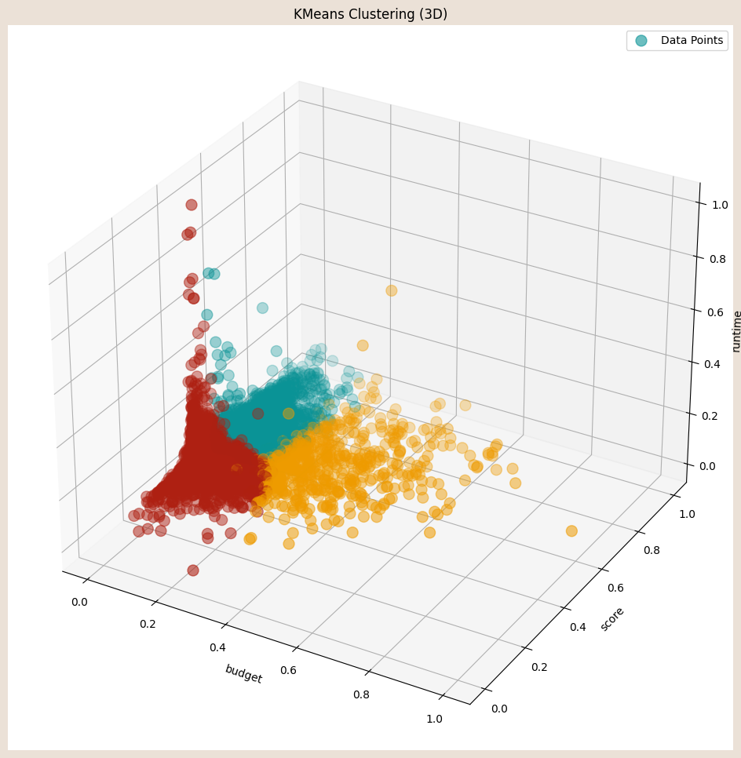

# Joaquín Aguirre

**Licenciado en Economía** por la Universidad Nacional de Córdoba (UNC), Diplomado en Ciencia de Datos por la FAMAF de la UNC y estudiante de la Maestría en Econometría de la Universidad Torcuato Di Tella (UTDT), con experiencia en consultoría e investigación académica.

**Intereses:** estadística, análisis y ciencia de datos, econometría, economía.

*Contacto:*
- ✉️ **e-mail**: jaguirre@mi.unc.edu.ar
- ☎️ **Teléfono**: +5493513993271
- 🔗 **LinkedIn**: [jaguirre-econ](https://www.linkedin.com/in/jaguirre-econ/)

### 📄 [Link a CV](https://github.com/jaguirre-econ/profile/blob/main/CV%20-%20Aguirre%2C%20Joaqu%C3%ADn.pdf)

[Python](#python)

[Python](#🐍python)

# Proyectos de análisis y ciencia de datos

## 📊 Power BI 

**Proyecto 'Pizza Sales':** 🔗 [**Link**]()

Dashboard referido a una compañía ficticia dedicada a la venta de pizzas. 

## 💻 SQL

**Proyecto 'Pizza Sales':** 🔗 [**Link**]()

Queries sobre el dataset referido a una compañía ficticia dedicada a la venta de pizzas. 

## 🐍 Python 

**Proyecto de Deep Learning 'Diabetes':** 🔗 [**Link**](https://github.com/jaguirre-econ/Proyectos-Ciencia-de-Datos/blob/main/Deep_Learning_Diabetes.ipynb)

Hecho en el marco de la Diplomatura en Ciencia de Datos de la FAMAF (UNC), se trabaja con un dataset con 70.692 entradas y 21 variables correspondiente a los resultados de una encuesta telefónica hecha en Estados Unidos en la que se le pregunta a cientos de miles de personas sobre sus condiciones de salud, siendo la mitad de los encuestados no diabéticos (Diabetes_binary = 0), y la otra mitad diabéticos (Diabetes_binary = 1). Luego de explorar el dataset (EDA) se entrenan modelos de redes neuronales que puedan predecir correctamente si un individuo es o no diabético de acuerdo a sus otras característcas. 

**Proyecto de Aprendizaje No Supervisado 'Películas IMDB':** 🔗 [**Link**](https://github.com/jaguirre-econ/Proyectos-Ciencia-de-Datos/blob/main/Non_Supervised_Movies.ipynb)

Hecho en el marco de la Diplomatura en Ciencia de Datos de la FAMAF (UNC), se trabaja con un data frame con datos correspondientes a más de 45 mil películas. Para cada una de ellas se pueden analizar 13 atributos diferentes, como el año de estreno, el género y su puntaje en la página de críticas y reseñas 'IMDB'. En este trabajo se explora y cura el dataset para luego poder aplicar técnicas de aprendizaje no supervisado que permiten generar clusters de películas.

## 📈 R

